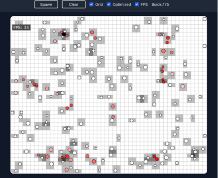

# Boids Experiment
## Made with Vite | React 18 | Tailwind CSS | TypeScript | HTML5 Canvas

### What is this?

A quick experiment to play about with the latest React hooks feaures as well as
have fun with some 2D physics and collision detection.

#### Features
* You can spawn lots of boids which collide with each other and the canvas bounds
* You can clear them
* You can toggle an interactive heat map grid
* You can toggle between high/low performance modes
* You can see and toggle an FPS display
* No WebGL or anthing fancy, just standard HTML5 Canvas
* Reasonably clean...

## How to use?

1. Clone this Git Repo
2. cd to the 'boids' folder
3. npm install
4. npm run dev
5. A localhost instance should be generated for you

## Anything interesting?

There is a low and high performance mode that can be toggled via the UI,
what this does is swap between a O(n^2) collision sweep and a O(2^n) complexity
which significantly improves the end result.

The boids collide fairly well even in the optimized settings and the code is clean
enough for people to learn from if they woud like to.

You may also find some of the math utilities such as the Vector2 handy.
